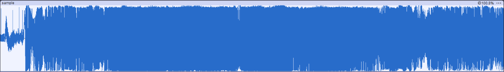
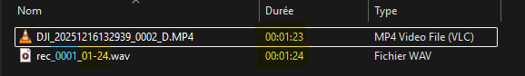

# FPVSoundLogger
A DIY RP2040-Zero based onboard audio recorder for FPV drones. It uses a MEMS mic and SD card module to capture sound, automatically triggered by Betaflight arming via pinio_box. Recordings match DJI goggles video length for seamless editing. Includes hardware design, MicroPython code, and examples.

###### Enjoy this project or find it useful? Feel free to buy me a coffee ☕ to support its development. 

## Project Background

I first started experimenting with the excellent and promising [OpenIPC](https://github.com/openipc) project, driven by my love for tinkering, hacking, and coding. The idea of building an open FPV video system was incredibly appealing.
But after many tests, the freeze issues and limited range eventually convinced me to switch to DJI for reliable everyday flying.
(But I promise — I’ll come back to OpenIPC!)

The DJI O4 Air Unit provides fantastic onboard video recordings.
But (because there's always a “but”), it still doesn’t record audio. And audio truly adds something special — whether for aggressive FPV flying or even some cinematic flights.

So I wanted a solution that would be simple/lightweight/inexpensive and capable of recording high‑quality audio and perfectly* synchronized with DJI recordings.
This project is the result of that idea.

##### Démo

## Features
- Autonomous module
- Work with Betaflight/INAV
- Enable/disable recording
- Auto record using arm/disarm trigger
- Audio/video share the same duration*

## Prerequisites

- A flight controller running **Betaflight**/**INAV** with at least two available PINIO outputs
- A transmitter (TX) capable of assigning **AUX channels** (EdgeTX, OpenTX, etc.)
- A stable **3.3V** output on the flight controller and a **common ground**
- A free **switch** or similar to toggle recording modes
- Basic soldering tools for connecting power, ground, and signal wires and plenty of flux — <u>***flux is life***</u>

## How It Works

- Use one of your TX switches to **Enable recording mode**
- **Arm your drone**: the module immediately starts **writing audio data** to the SD card
- **Once disarmed** — whether after a normal end of flight or a dramatic crash — the module **stops recording** and finalizes the audio file with the proper header
- Remove the SD card and retrieve the **WAV file** that matches the exact flight duration
- Import the audio into your favorite video editor and drop it on the timeline — it syncs effortlessly with the DJI footage !

## Architecture / Hardware Overview

- INMP441 I2S NEMS Mic

[INMP441](resources/images/INMP441.png)
The INMP441 is a high-performance, low power, digital-output, omnidirectional MEMS microphone.

    - compact 14x14mm PCB Size
    - only 0.35gr

## Build & Installation & Configuration

- You'll need to configure AUX channel on your TX to Enable/Disable recording

    > I configured it to use the center position of an three-position switch mapped to AUX6 on my Radiomaster Pocket running on EdgeTX.

- Provide a **common ground** from the flight controller to the module, along with a clean **3.3V** supply

    > On my JHEMCU GF20F722, I used the 3.3V rail that was originally intended for a DSM receiver.

- Configure your flight controller’s PINIO outputs to deliver the required logic levels:

    - One PINIO controls record enable/disable
    - The second PINIO follows the arm/disarm sequence to automatically start and stop recording.

###### TODO
- append && use conf file (only arm/disarm mode)

